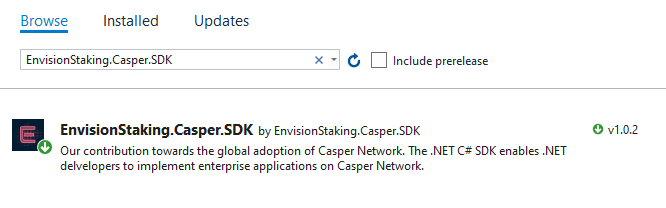
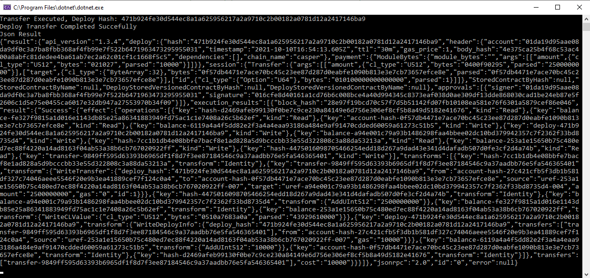
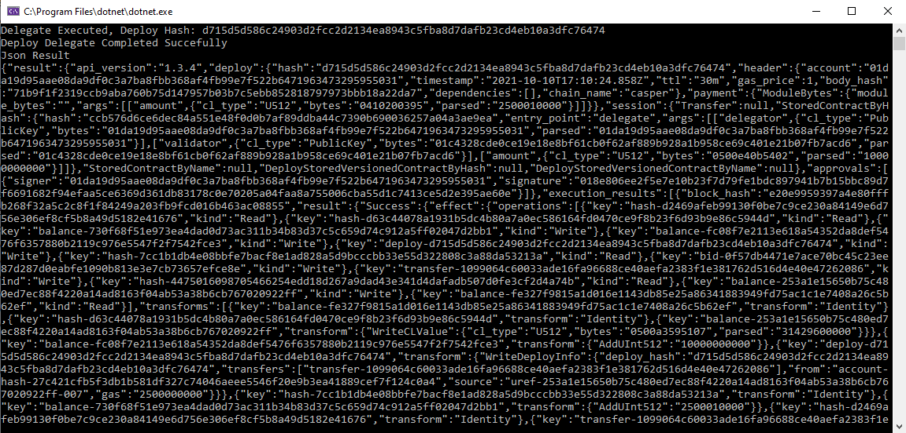
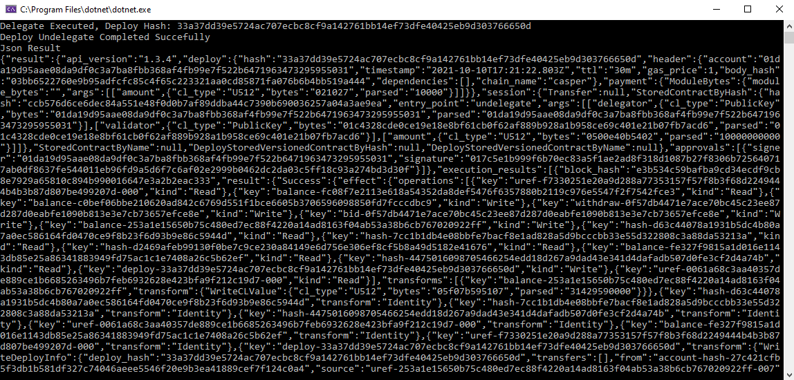
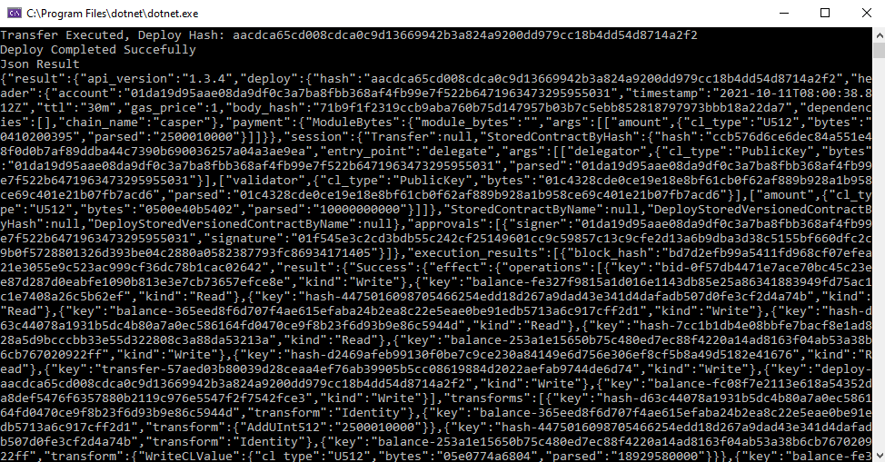

# Casper .NET C# SDK

Our contribution towards the global adoption of Casper Network. 
The .NET C# SDK enables .NET delvelopers to implement enterprise applications on Casper Network.

The available sections in this document are
* [Getting Started](https://github.com/EnvisionStaking/Casper-CSharp-SDK#getting-started)
* [Casper Client Usage](https://github.com/EnvisionStaking/Casper-CSharp-SDK#casper-client)
* [How To Guides](https://github.com/EnvisionStaking/Casper-CSharp-SDK#how-to-guides)
# Getting Started
If you are not familiar with Casper Network, our advice is to navigate to [Casper Labs](https://casperlabs.io/) or [Casper Network Documents](https://docs.casperlabs.io/en/latest/faq/index.html) and get prepared before proceeding with this SDK.
## What is Casper?
Casper is an open-source Proof-of-Stake blockchain network built off the CBC (Correct-by-Construction) Casper specification originally established by early Ethereum developers. The Casper network is optimized for enterprise and developer adoption by focusing on unique features like upgradeable contracts, predictable network fees, privacy flexibility, on-chain governance, and developer-friendly languages. Casper solves the scalability trilemma by allowing development teams to build with confidence that the network will optimize for security, decentralization, and high throughput.
## Adding the SDK to your .NET Project
The SDK is available as a [NuGet package](https://www.nuget.org/packages/EnvisionStaking.Casper.SDK/)
### Steps for adding Nuget Package in your project
* Open Visual Studio
* Create a new Project
* Install Nuget package. You can add the package via CLI command or through NuGet package manager.
  > **.NET CLI** \
  > Run the following command to add NuGet package in your project.
  > ```CLI
  > dotnet add <YourProjectName> package EnvisionStaking.Casper.SDK
  >```

  > **NuGet Package Manager**
  > * Right Click on your project
  > * Select Manage NuGet packages
  > * Search for EnvisionStaking.Casper.SDK package
  > 
  > * Install the latest version of the package
  > * You are ready to use the Casper SDK
# Casper Client
The Casper client is the main class of the SDK, in which you can interact with Casper Network. 

You can instantiate the Casper client as shown below
```C#
//The constructor parameter (rpcUrl) is the address of a Connected Peer in Casper Network.
//For RPC calls please use port 7777
//Set the Node Ip and Port, i.e http://54.183.43.215:7777/rpc
string rpcUrl = "http://{NodeIp}:{7777}/rpc";
CasperClient casperClient = new CasperClient(rpcUrl);
```
> You can find the available Connected Peers [here](https://cspr.live/tools/peers)
> 
The following services are available in the SDK via CasperClient:
* [Remote Procedure Calls Service](https://github.com/EnvisionStaking/Casper-CSharp-SDK/blob/main/README.md#remote-procedure-calls-service)
  * [Quering Casper Network](https://github.com/EnvisionStaking/Casper-CSharp-SDK/blob/main/README.md#quering-casper-network)
  * [Common Deploy Operations](https://github.com/EnvisionStaking/Casper-CSharp-SDK/blob/main/README.md#common-deploy-operations)
  * [Other Deploy Operations](https://github.com/EnvisionStaking/Casper-CSharp-SDK/blob/main/README.md#other-deploy-operations)
  * [Asynchronous Operations](https://github.com/EnvisionStaking/Casper-CSharp-SDK/blob/main/README.md#asynchronous-operations)
* [Server-Sent Events Service - Event Driven Operations](https://github.com/EnvisionStaking/Casper-CSharp-SDK/blob/main/README.md#server-sent-events-service)
* [Hash Service](https://github.com/EnvisionStaking/Casper-CSharp-SDK/blob/main/README.md#hash-service)
* [Signing Service](https://github.com/EnvisionStaking/Casper-CSharp-SDK/blob/main/README.md#signing-service)

## Remote Procedure Calls Service
The RPC service uses Remote Procedure Calls (RPC) in Casper Network nodes. 
RPC enables the integartion with Capser Network.
The SDK available methods utilizing the RPC protocol in Casper Network are:
### Quering Casper Network
#### GetStateRootHash
This method returns the latest state root hash
```C#
string rpcUrl = "http://{NodeIp}:{7777}/rpc";

CasperClient casperClient = new CasperClient(rpcUrl);
var result = casperClient.RpcService.GetStateRootHash();
```

#### GetStateRootHashByBlockHash
This method returns a state root hash at a given Block by using the block hash
```C#
string rpcUrl = "http://{NodeIp}:{7777}/rpc";
string blockHash = "eae069dcc4888da536dfc3f33509025a936d14bf09c012cc8073ee0d91e3ce84";

CasperClient casperClient = new CasperClient(rpcUrl);
var result = casperClient.RpcService.GetStateRootHashByBlockHash(blockHash);
```
#### GetStateRootHashByHeight
This method returns a state root hash at a given Block by using the block height
```C#
string rpcUrl = "http://{NodeIp}:{7777}/rpc";
string blockHeight = "223873";

CasperClient casperClient = new CasperClient(rpcUrl);
var result = casperClient.RpcService.GetStateRootHashByHeight(blockHeight);
```
#### GetAccountInfo
This method returns an Account from the network
```C#
string rpcUrl = "http://{NodeIp}:{7777}/rpc";
string accountKey = "0202ba37a693fb6494b3c42a65f07a6123dd125d8bf8a16e10ec7b95b826b151230c";

CasperClient casperClient = new CasperClient(rpcUrl);
var result = casperClient.RpcService.GetAccountInfo(accountKey);
```
#### GetAccountHash
This method returns the Account Hash of an Account from the network
```C#
string rpcUrl = "http://{NodeIp}:{7777}/rpc";
string accountKey = "0202ba37a693fb6494b3c42a65f07a6123dd125d8bf8a16e10ec7b95b826b151230c";

CasperClient casperClient = new CasperClient(rpcUrl);
var result = casperClient.RpcService.GetAccountHash(accountKey);
```
#### GetAccountMainPurse
This method returns the Main Purse of an Account from the network
```C#
string rpcUrl = "http://{NodeIp}:{7777}/rpc";
string accountKey = "0202ba37a693fb6494b3c42a65f07a6123dd125d8bf8a16e10ec7b95b826b151230c";

CasperClient casperClient = new CasperClient(rpcUrl);
var result = casperClient.RpcService.GetAccountMainPurse(accountKey);
```
#### GetAccountBalance
This method returns a purse's balance from the network
```C#
string rpcUrl = "http://{NodeIp}:{7777}/rpc";
string accountKey = "0202ba37a693fb6494b3c42a65f07a6123dd125d8bf8a16e10ec7b95b826b151230c";

CasperClient casperClient = new CasperClient(rpcUrl);
var result = casperClient.RpcService.GetAccountBalance(accountKey);
```
#### GetAuctionInfo
This method returns the bids and validators as of either a specific block (by height or hash), or the most recently added block
```C#
string rpcUrl = "http://{NodeIp}:{7777}/rpc";

CasperClient casperClient = new CasperClient(rpcUrl);
var result = casperClient.RpcService.GetAuctionInfo();
```
#### GetBlockLast
This method returns the latest Block from the network
```C#
string rpcUrl = "http://{NodeIp}:{7777}/rpc";

CasperClient casperClient = new CasperClient(rpcUrl);
var result = casperClient.RpcService.GetBlockLast();
```
#### GetBlockByHash
This method returns a Block from the network for a specific block hash
```C#
string rpcUrl = "http://{NodeIp}:{7777}/rpc";
string blockHash = "3566b6cdc30d0d9871cc6b208a7b17acefa1e22107800a098c4cd88e82a6fee2";

CasperClient casperClient = new CasperClient(rpcUrl);
var result = casperClient.RpcService.GetBlockByHash(blockHash);
```
#### GetBlockByHeight
This method returns a Block from the network for a specific block height
```C#
string rpcUrl = "http://{NodeIp}:{7777}/rpc";
string blockHeight = "222938";

CasperClient casperClient = new CasperClient(rpcUrl);
var result = casperClient.RpcService.GetBlockByHeight(blockHeight);
```
#### GetBlockTransfersLast
This method returns the latest Block Transfers from the network
```C#
string rpcUrl = "http://{NodeIp}:{7777}/rpc";

CasperClient casperClient = new CasperClient(rpcUrl);
var result = casperClient.RpcService.GetBlockTransfersLast();
```
#### GetBlockTransfersByHash
This method returns Block Transfers from the network for a specific block hash
```C#
string rpcUrl = "http://{NodeIp}:{7777}/rpc";
string blockHash = "3566b6cdc30d0d9871cc6b208a7b17acefa1e22107800a098c4cd88e82a6fee2";

CasperClient casperClient = new CasperClient(rpcUrl);
var result = casperClient.RpcService.GetBlockByHash(blockHash);
```
#### GetBlockTransfersByHeight
This method returns Block Transfers from the network for a specific block height
```C#
string rpcUrl = "http://{NodeIp}:{7777}/rpc";
string blockHeight = "222938";

CasperClient casperClient = new CasperClient(rpcUrl);
var result = casperClient.RpcService.GetBlockTransfersByHeight(blockHeight);
```
#### GetDeploy
This method returns a Deploy from the network
```C#
string rpcUrl = "http://{NodeIp}:{7777}/rpc";
string deployHash = "bc4b4fa65eb906e6d4e383adacb8e8ba14b768029a535b5b1381b2b47847c32e";

CasperClient casperClient = new CasperClient(rpcUrl);
var result = casperClient.RpcService.GetDeploy(deployHash);
```
#### GetNodeMetrics
This method returns the Node Metrics for a specifict network node
```C#
string rpcUrl = "http://{NodeIp}:{7777}/rpc";
//For Metric calls please use port 8888
string metricsUrl = "http://{NodeIp}:{8888}/metrics";

CasperClient casperClient = new CasperClient(rpcUrl);
var result = casperClient.RpcService.GetNodeMetrics(metricsUrl);
```
#### GetNodeStatus
This method returns the current Node Status for a specific network node
```C#
string rpcUrl = "http://{NodeIp}:{7777}/rpc";

CasperClient casperClient = new CasperClient(rpcUrl);
var result = casperClient.RpcService.GetNodeStatus();
```
#### GetShema
This method returns the OpenRPC Schema. The schema describes the JSON-RPC API of a node on the Casper network.
```C#
string rpcUrl = "http://{NodeIp}:{7777}/rpc";

CasperClient casperClient = new CasperClient(rpcUrl);
var result = casperClient.RpcService.GetRPCShema();
```
#### GetStateItem
This method returns a stored value from the network. Stored values can be Account, Deploy, CLVAlue, Transfer, Contract, ContractPackage, ContractWasm, Bid, Withdraw, EraInfo etc.
```C#
string rpcUrl = "http://{NodeIp}:{7777}/rpc";
string hash = "account-hash-18afc5167d3e815c80cd0742f615dddfebee2a2f5e8285015b23b8d134292a5c";

CasperClient casperClient = new CasperClient(rpcUrl);
var result = casperClient.RpcService.GetStateItem(hash);
```

> ##### Stored Value examples
> * For Account you can use hash -> "account-hash-18afc5167d3e815c80cd0742f615dddfebee2a2f5e8285015b23b8d134292a5c"
> * For Deploy you can use hash -> "deploy-bc4b4fa65eb906e6d4e383adacb8e8ba14b768029a535b5b1381b2b47847c32e"
> * For CLVAlue you can use hash -> "uref-fdb1ba9c73573817ff05674e8d488a2eea95fd8d22942c250035e1063c899fa8-007"
> * For Transfer you can use hash -> "transfer-8083a53dd4d911eabefb83004eab3537aee8d8b9a340dced9826f1397b3b0bee"
> * For Contract you can use hash -> "hash-7cc1b1db4e08bbfe7bacf8e1ad828a5d9bcccbb33e55d322808c3a88da53213a"
> * For ContractPackage you can use hash -> "hash-4475016098705466254edd18d267a9dad43e341d4dafadb507d0fe3cf2d4a74b"
> * For ContractWasm you can use hash -> "hash-41c6f5bad412de7e16af7943b0c751f0dc9152a337c8b024313057dd8d707f99"
> * For Bid you can use hash -> "bid-0f57db4471e7ace70bc45c23ee87d287d0eabfe1090b813e3e7cb73657efce8e"
> * For Withdraw you can use hash -> "withdraw-6e999553ae78baf7799c6a10136888509d3f54cd896b0fe67376f45474180337"
> * For Balance you can use hash -> "balance-15afef2c401a62397cd7a91a7d1d077cb8c71f2ec9a75449d1cd32658f9c3806"

#### GetNodePeers
This method returns a list of peers connected to the node
```C#
string rpcUrl = "http://{NodeIp}:{7777}/rpc";

CasperClient casperClient = new CasperClient(rpcUrl);
var result = casperClient.RpcService.GetNodePeers();
```
#### GetEraInfoLast
This method returns the last EraInfo from the network
```C#
string rpcUrl = "http://{NodeIp}:{7777}/rpc";

CasperClient casperClient = new CasperClient(rpcUrl);
var result = casperClient.RpcService.GetEraInfoLast();
```
#### GetEraInfoByHash
This method returns an EraInfo from the network from Era hash
```C#
string rpcUrl = "http://{NodeIp}:{7777}/rpc";
string blockHash = "d0b3f52c02f8dfee84bdc5cb2e00d803d2dc36f3ed325cf556412baef6ead722";

CasperClient casperClient = new CasperClient(rpcUrl);
var result = casperClient.RpcService.GetEraInfoByHash(blockHash);
```
#### GetEraInfoByHeight
This method returns an EraInfo from the network
```C#
string rpcUrl = "http://{NodeIp}:{7777}/rpc";
string blockHeight = "223692";

CasperClient casperClient = new CasperClient(rpcUrl);
var result = casperClient.RpcService.GetEraInfoByHeight(blockHeight);
```

## Common Deploy Operations
These are the common operations available on casper Network. 
With these operations available in the SDK you can transfer, delegate and undelegate tokens.
The following operations are defined as ExecutableDeployItems.
> For further information please reference Casper Network [Documentation](https://docs.casperlabs.io/en/latest/implementation/serialization-standard.html#payment-session)
### Transfer Tokens
This deploys a Transfer in Casper Network.
The operation uses the Transfer ExecutableDeployItem
```C#
string rpcUrl = "http://{NodeIp}:{7777}/rpc";
string blockHeight = "223692";

CasperClient casperClient = new CasperClient(rpcUrl);

/// <param name="amount">The amount to transfer in CSPR tokens</param>
/// <param name="fromAccount">From the Account Key to transfer tokens</param>
/// <param name="toAccount">To the Account Key to transfer tokens</param>
/// <param name="id">Id of ttransfer</param>
/// <param name="publicKeyLocation">Public Key location of pem file located on disk</param>
/// <param name="privateKeyLocation">Secret Key location of pem file located on disk</param>
/// <param name="signAlgorithm">The signature algorith. You can use either ed25519 or secp256k1 algorithm. The algorithm should macth the keys provided</param>
var result = casperClient.DeployService.Transfer(amount, fromAccount, toAccountKey, id, @"keys\Ed25519_Test_public_key.pem", @"keys\Ed25519_Test_secret_key.pem", SignAlgorithmEnum.ed25519);
```
> In case you want to make the deploy to Json you can use the method TransferToJson
### Delegate Tokens
This method Delegate tokens to a Validator
This operation uses the ExecutableDeployItem StoredContractByHash
```C#
string rpcUrl = "http://{NodeIp}:{7777}/rpc";
string blockHeight = "223692";

CasperClient casperClient = new CasperClient(rpcUrl);

/// <param name="amount">The amount to transfer in CSPR tokens</param>
/// <param name="fromAccount">Delegator Account Key</param>
/// <param name="toAccount">validator Account Key</param>
/// <param name="id">Id of ttransfer</param>
/// <param name="publicKeyLocation">Public Key location of pem file located on disk</param>
/// <param name="privateKeyLocation">Secret Key location of pem file located on disk</param>
/// <param name="signAlgorithm">The signature algorith. You can use either ed25519 or secp256k1 algorithm. The algorithm should macth the keys provided</param>
var result = casperClient.DeployService.Delegate(amount, fromAccountKey, toAccountKey, id, @"keys\Ed25519_Test_public_key.pem", @"keys\Ed25519_Test_secret_key.pem", SignAlgorithmEnum.ed25519);
```
> In case you want to make the deploy to Json you can use the method DelegateToJson
### Undelegate Tokens
This method Undelegate tokens from a Validator
This operation uses the ExecutableDeployItem StoredContractByHash
```C#
string rpcUrl = "http://{NodeIp}:{7777}/rpc";
string blockHeight = "223692";

CasperClient casperClient = new CasperClient(rpcUrl);

/// <param name="amount">The amount to transfer in CSPR tokens</param>
/// <param name="fromAccount">Delegator Account Key</param>
/// <param name="toAccount">Validator Account Key</param>
/// <param name="id">Id of ttransfer</param>
/// <param name="publicKeyLocation">Public Key location of pem file located on disk</param>
/// <param name="privateKeyLocation">Secret Key location of pem file located on disk</param>
/// <param name="signAlgorithm">The signature algorith. You can use either ed25519 or secp256k1 algorithm. The algorithm should macth the keys provided</param>
var result = casperClient.DeployService.Undelegate(amount, fromAccountKey, toAccountKey, id, @"keys\Ed25519_Test_public_key.pem", @"keys\Ed25519_Test_secret_key.pem", SignAlgorithmEnum.ed25519);
```
> In case you want to make the deploy to Json you can use the method UndelegateToJson
## Other Deploy Operations
Many other Deploy operations are available on Casper Network. 
You have the freedom to construct your own request and deploy the Contract by using the SDK methods following.
### Put Deploy Stored Contract By Hash
This method deploys StoredContractByHash operation.
The Delegate and Undelegate methods described above uses the StoredContractByHash operation.
This operation uses the ExecutableDeployItem StoredContractByHash.
```C#
string rpcUrl = "http://{NodeIp}:{7777}/rpc";
CasperClient casperClient = new CasperClient(rpcUrl);

//Costruct the Deploy executable item and set the Object parameters 
PutDeployStoredContractByHashRequest request = new PutDeployStoredContractByHashRequest();
PutDeployResult result = casperClient.RpcService.PutDeploy(request);
```
> For a complete example please reference the [How to Deploy Stored Contract By Hash](https://github.com/EnvisionStaking/Casper-CSharp-SDK#how-to-deploy-stored-contract-by-hash).
 ### Put Deploy Stored Contract By Name
This method deploys StoredContractByName operation.
This operation uses the ExecutableDeployItem StoredContractByName.
```C#
string rpcUrl = "http://{NodeIp}:{7777}/rpc";
CasperClient casperClient = new CasperClient(rpcUrl);

//Costruct the Deploy executable item and set the Object parameters 
PutDeployStoredContractByNameRequest request = new PutDeployStoredContractByNameRequest();
PutDeployResult result = casperClient.RpcService.PutDeploy(request);
```
### Put Deploy Stored Versioned Contract By Hash
This method deploys StoredVersionedContractByHash operation.
This operation uses the ExecutableDeployItem StoredVersionedContractByHash.
```C#
string rpcUrl = "http://{NodeIp}:{7777}/rpc";
CasperClient casperClient = new CasperClient(rpcUrl);

//Costruct the Deploy executable item and set the Object parameters 
PutDeployStoredVersionedContractByHashRequest request = new PutDeployStoredVersionedContractByHashRequest();
PutDeployResult result = casperClient.RpcService.PutDeploy(request);
```
### Put Deploy Stored Versioned Contract By Name
This method deploys StoredVersionedContractByName operation.
This operation uses the ExecutableDeployItem StoredVersionedContractByName.
```C#
string rpcUrl = "http://{NodeIp}:{7777}/rpc";
CasperClient casperClient = new CasperClient(rpcUrl);

//Costruct the Deploy executable item and set the Object parameters 
PutDeployStoredVersionedContractByNameRequest request = new PutDeployStoredVersionedContractByNameRequest();
PutDeployResult result = casperClient.RpcService.PutDeploy(request);
```
### Put Deploy Transfer
This method deploys Transfer operation.
The Transfer method described above uses the Transfer operation.
This operation uses the ExecutableDeployItem Transfer.
```C#
string rpcUrl = "http://{NodeIp}:{7777}/rpc";
CasperClient casperClient = new CasperClient(rpcUrl);

//Costruct the Deploy executable item and set the Object parameters 
PutDeployTransferRequest request = new PutDeployTransferRequest();
PutDeployResult result = casperClient.RpcService.PutDeploy(request);
```
> For a complete example please reference the How To Guides section.

## Asynchronous Operations
You can use the following asynchronous operations.
### Get Next Block Async
This async method returns a result once a block is generated in Casper Network

```C#
string rpcUrl = "http://{NodeIp}:{7777}/rpc";

CasperClient casperClient = new CasperClient(rpcUrl);
var result = await casperClient.RpcService.GetNextBlockAsync();
```
### Get Next N Block Async
This async method returns a result once next N block is generated in Casper Network

```C#
string rpcUrl = "http://{NodeIp}:{7777}/rpc";

CasperClient casperClient = new CasperClient(rpcUrl);

//The result will be completed after the generation of 2 blocks from the time method triggered.
var result = await casperClient.RpcService.AwaitNBlockAsync(2);
```
### Await Until Height Block Generated Async
This async method returns a result when a block is generated for a specific height

```C#
string rpcUrl = "http://{NodeIp}:{7777}/rpc";

CasperClient casperClient = new CasperClient(rpcUrl);

//Get current block Height
var currentBlock = casperClient.RpcService.GetBlockLast();
//After getting the current block height, add 2 blocks and wait until block generated with that specific height
var result = await casperClient.RpcService.AwaitUntilNBlockAsync(currentBlock.result.block.header.height+2);
```
### Get Next Era Async
This async method returns a result once an Era is completed in Casper Network
Please note that an Era is generated every two hours
```C#
string rpcUrl = "http://{NodeIp}:{7777}/rpc";

 CasperClient casperClient = new CasperClient(rpcUrl);
var result = await casperClient.RpcService.GetNextEraAsync();
```
### Get Next N Era Async
This async method returns a result once next N Era is completed in Casper Network
Please note that an Era is generated every two hours
```C#
string rpcUrl = "http://{NodeIp}:{7777}/rpc";

CasperClient casperClient = new CasperClient(rpcUrl);

//The result will be completed after the completion of 2 Eras from the time method triggered.
var result = await casperClient.RpcService.AwaitNEraAsync(1);
```
### Await Until Era with Id Completed Async
This async method returns a result when an Era is completed with a specific id.
Please note that an Era is generated every two hours
```C#
string rpcUrl = "http://{NodeIp}:{7777}/rpc";

CasperClient casperClient = new CasperClient(rpcUrl);

//Get current Era from last block
var currentBlock = casperClient.RpcService.GetBlockLast();
//After getting the current Era, add 1 Era and wait until Era completed with that specific id
var result = await casperClient.RpcService.AwaitUntilNEraAsync(currentBlock.result.block.header.era_id + 1);
```
### Await Until Deploy is Completed Async
This async method returns a result when a Deployment is completed.
You can use this async method to wait until  Deployment completion.
```C#
string rpcUrl = "http://{NodeIp}:{7777}/rpc";
var deployHash = "b96bc0f44dd79c6793d16c52e53760004367c8400de0eb17e46edda75289a856";

CasperClient casperClient = new CasperClient(rpcUrl);
var deployResult = await casperClient.RpcService.AwaitUntilDeployCompletedAsync(deployHash);
```
## Server-Sent Events Service
The Server-Sent Events (SSE) is a server push technology enabling a client to receive automatic updates from a server through an HTTP connection.
SSE is fully supported by Casper Network. With this SDK you are able to subscribe to events and utilize the event driven operations.

### Event Driven Operations

#### Api Version Updated
This event triggers every couple of seconds/minutes with the API Verion.
```C#
string rpcUrl = "http://{NodeIp}:{7777}/rpc";

CasperClient casperClient = new CasperClient(sseUrl);

casperClient.SseService = new SseService(sseUrl, SseTypeEnum.main);
casperClient.SseService.ApiVersionUpdated += SseService_ApiVersionUpdated;

void SseService_ApiVersionUpdated(object sender, SseApiVersion e)
{
	result = e;
}
```
#### Block Added
This event triggers when a Block is added in Casper Network.
```C#
string rpcUrl = "http://{NodeIp}:{7777}/rpc";

CasperClient casperClient = new CasperClient(sseUrl);

casperClient.SseService = new SseService(sseUrl, SseTypeEnum.main);
casperClient.SseService.BlockAdded += SseService_BlockAdded;

void SseService_BlockAdded(object sender, SseBlockAdded e)
{
	result = e;
}
```
#### Deploy Processed
This event triggers when a Deploy is Processed in Casper Network.
```C#
string rpcUrl = "http://{NodeIp}:{7777}/rpc";

CasperClient casperClient = new CasperClient(sseUrl);

casperClient.SseService = new SseService(sseUrl, SseTypeEnum.main);
casperClient.SseService.DeployProcessed += SseService_DeployProcessed;

void SseService_DeployProcessed(object sender, SseDeployProcessed e)
{
	result = e;
}
```
#### Deploy Accepted
This event triggers when a Deploy is Accepted in Casper Network.
```C#
string rpcUrl = "http://{NodeIp}:{7777}/rpc";

CasperClient casperClient = new CasperClient(sseUrl);

casperClient.SseService = new SseService(sseUrl, SseTypeEnum.deploys);
casperClient.SseService.DeployAccepted += SseService_DeployAccepted;

void SseService_DeployAccepted(object sender, SseDeployAccepted e)
{
	result = e;
}
```
#### Fault Occured
This event triggers on Fault occurance in Casper Network.
```C#
string rpcUrl = "http://{NodeIp}:{7777}/rpc";

CasperClient casperClient = new CasperClient(sseUrl);

casperClient.SseService = new SseService(sseUrl, SseTypeEnum.main);
casperClient.SseService.Fault += SseService_Fault;

void SseService_Fault(object sender, string e)
{
	result = e;
}
```
#### Step Processed
This event triggers when a step is processed in Casper Network.
```C#
string rpcUrl = "http://{NodeIp}:{7777}/rpc";

CasperClient casperClient = new CasperClient(sseUrl);

casperClient.SseService = new SseService(sseUrl, SseTypeEnum.main);
casperClient.SseService.Step += SseService_Step;

void SseService_Step(object sender, string e)
{
	result = e;
}
```
#### Finality Signature
This event triggers on Finality Signature in Casper Network.
```C#
string rpcUrl = "http://{NodeIp}:{7777}/rpc";

CasperClient casperClient = new CasperClient(sseUrl);

casperClient.SseService = new SseService(sseUrl, SseTypeEnum.sigs);
casperClient.SseService.FinalitySignature += SseService_FinalitySignature;

void SseService_FinalitySignature(object sender, SseFinalitySignature e)
{
	result = e;
}
```

## Hash Service
The hash service utilizes BLAKE2b which is a cryptographic hash function. 
Blake2b is optimized for 64-bit and produces digests of any size between 1 and 64 bytes.
#### Get Account Hash
Get the Account Hash from the Account key with BLAKE2b.
```C#
string rpcUrl = "http://{NodeIp}:{7777}/rpc";

string publicKey = "01c4328cde0ce19e18e8bf61cb0f62af889b928a1b958ce69c401e21b07fb7acd6";

CasperClient casperClient = new CasperClient(rpcUrl);
var result = casperClient.HashService.GetAccountHash(publicKey);
```
#### Get Hash To Hexadecimal
Get the Hash to hexadecimal value with BLAKE2b.
```C#
string rpcUrl = "http://{NodeIp}:{7777}/rpc";

string message = "Hello World";

CasperClient casperClient = new CasperClient(rpcUrl);
var result = casperClient.HashService.GetHashToHexFixedSize(Encoding.UTF8.GetBytes(message), 32);
```
#### Get Hash To Byte Array
Get the Hash to Byte Array with BLAKE2b.
```C#
string rpcUrl = "http://{NodeIp}:{7777}/rpc";

string message = "Hello World";

CasperClient casperClient = new CasperClient(rpcUrl);
var result = casperClient.HashService.GetHashToBinaryFixedSize(Encoding.UTF8.GetBytes(message), 32);
```

## Signing Service
Casper Network currently supports two Digital Signature Algorithms Ed25519 and Secp256k1. These algorithms are responsible for signing deploys on Casper Network.
Ed25519 is an EdDSA signature scheme using SHA-512 (SHA-2) and Curve25519.
Secp256k1 is an EdDSA signature scheme using elliptic curve and became very popular due to Bitcoin usage.
### Ed25519 Methods
#### Get Key Pair From File Ed25519
Get the Public-Private key pair from pem file
```C#
string rpcUrl = "http://{NodeIp}:{7777}/rpc";

CasperClient casperClient = new CasperClient(rpcUrl);
var keyPair = casperClient.SigningService.GetKeyPairFromFile(@"keys\Ed25519_Test_public_key.pem", @"Ed25519_Test_keys\secret_key.pem", SignAlgorithmEnum.ed25519);
```
#### Get Key Pair From Stream Ed25519
Get the Public-Private key pair from Stream
```C#
string rpcUrl = "http://{NodeIp}:{7777}/rpc";

CasperClient casperClient = new CasperClient(rpcUrl);

//Get files to Stream
FileStream publicKeyStream = File.OpenRead(@"keys\Ed25519_Test_public_key.pem");
FileStream privateKeyStream = File.OpenRead(@"keys\Ed25519_Test_secret_key.pem");

var keyPair = casperClient.SigningService.GetKeyPair(publicKeyStream, privateKeyStream, SignAlgorithmEnum.ed25519);
```
#### Generate Key Pair Ed25519
Generate Key Pair
```C#
string rpcUrl = "http://{NodeIp}:{7777}/rpc";

CasperClient casperClient = new CasperClient(rpcUrl);

var keyPair = casperClient.SigningService.GenerateKeyPair(SignAlgorithmEnum.ed25519);
```
#### Generate Signature Ed25519
Generate Signature
```C#
string rpcUrl = "http://{NodeIp}:{7777}/rpc";

string account = "0123e52cf5d878e4ba3c388a6e1969a56a5b86d52f3c8fd0dd8463797c90b4dad6";
string deployHash = "55761719042cf6ffd1b74005cd946a9d70dd363a63a495f5ecaa6d4990a256d5";

CasperClient casperClient = new CasperClient(rpcUrl);
var keyPair = casperClient.SigningService.GetKeyPairFromFile(@"keys\Ed25519_Test_public_key.pem", @"keys\Ed25519_Test_secret_key.pem", SignAlgorithmEnum.ed25519);

var signedValueResultBytes = casperClient.SigningService.GetSignatureEd25519(keyPair.Private, ByteUtil.HexToByteArray(deployHash));
var signedValueResultHex = ByteUtil.ByteArrayToHex(signedValueResultBytes);

//The fist byte within the signature is 1 in the case of an Ed25519 signature or 2 in the case of Secp256k1.
var result = account.Substring(0, 2) + signedValueResultHex;
```
#### Verify Signature Ed25519
Verify Signature
```C#
string rpcUrl = "http://{NodeIp}:{7777}/rpc";

CasperClient casperClient = new CasperClient(rpcUrl);
var keyPair = casperClient.SigningService.GenerateKeyPair(SignAlgorithmEnum.ed25519);

var messageToSign = Encoding.UTF8.GetBytes("Test Message");
var messageToSignChanged = Encoding.UTF8.GetBytes("Test Message Changed");

var signedMessage = casperClient.SigningService.GetSignatureEd25519(keyPair.Private, messageToSign);

var signatureIsVerified = casperClient.SigningService.VerifySignatureEd25519(keyPair.Public, messageToSignChanged, signedMessage);
```
#### SignApproval Ed25519
Sign Hash key and generate Approval signature
```C#
string rpcUrl = "http://{NodeIp}:{7777}/rpc";

string accountKey = "0123e52cf5d878e4ba3c388a6e1969a56a5b86d52f3c8fd0dd8463797c90b4dad6";
string deployHash = "55761719042cf6ffd1b74005cd946a9d70dd363a63a495f5ecaa6d4990a256d5";

CasperClient casperClient = new CasperClient(rpcUrl);

var keyPair = casperClient.SigningService.GetKeyPairFromFile(@"keys\Ed25519_Test_public_key.pem", @"keys\Ed25519_Test_secret_key.pem", SignAlgorithmEnum.ed25519);

var approvalResult = casperClient.DeployService.SignApproval(accountKey,deployHash, keyPair);  
```
### Secp256k1 Methods
#### Get Key Pair From File Secp256k1
Get the Public-Private key pair from pem file
```C#
string rpcUrl = "http://{NodeIp}:{7777}/rpc";

CasperClient casperClient = new CasperClient(rpcUrl);
var keyPair = casperClient.SigningService.GetKeyPairFromFile(@"keys\Secp256k1_Test_public_key.pem", @"keys\Secp256k1_Test_secret_key.pem", SignAlgorithmEnum.secp256k1);
```
#### Get Key Pair From Stream Secp256k1
Get the Public-Private key pair from Stream
```C#
string rpcUrl = "http://{NodeIp}:{7777}/rpc";

CasperClient casperClient = new CasperClient(rpcUrl);

//Get files to Stream
FileStream publicKeyStream = File.OpenRead(@"keys\Secp256k1_Test_public_key.pem");
FileStream privateKeyStream = File.OpenRead(@"keys\Secp256k1_Test_secret_key.pem");

var keyPair = casperClient.SigningService.GetKeyPair(publicKeyStream, privateKeyStream, SignAlgorithmEnum.secp256k1);
```
#### Generate Key Pair Secp256k1
Generate Key Pair
```C#
string rpcUrl = "http://{NodeIp}:{7777}/rpc";

CasperClient casperClient = new CasperClient(rpcUrl);

var keyPair = casperClient.SigningService.GenerateKeyPair(SignAlgorithmEnum.secp256k1);
```
#### Generate Signature Secp256k1
Generate Signature
```C#
string rpcUrl = "http://{NodeIp}:{7777}/rpc";

string account = "0203a9cd2472eeedb7081dd87ecae04d8fe1cedbf5e6a9fcb158ad966d94c63d2c6d";
string deployHash = "207ecc7c47ebba4d71e9911702fa14d225ec78aab255ac82a59666c4b352bd81";

CasperClient casperClient = new CasperClient(rpcUrl);
var keyPair = casperClient.SigningService.GetKeyPairFromFile(@"keys\Secp256k1_Test_public_key.pem", @"keys\Secp256k1_Test_secret_key.pem", SignAlgorithmEnum.secp256k1);

var signedValueResultBytes = casperClient.SigningService.GetSignatureSecp256k1(keyPair.Private, ByteUtil.HexToByteArray(deployHash));
var signedValueResultHex = ByteUtil.ByteArrayToHex(signedValueResultBytes);
            
//The fist byte within the signature is 1 in the case of an Ed25519 signature or 2 in the case of Secp256k1.
var result = account.Substring(0, 2) + signedValueResultHex;
```
#### Verify Signature Secp256k1
Verify Signature
```C#
string rpcUrl = "http://{NodeIp}:{7777}/rpc";

CasperClient casperClient = new CasperClient(rpcUrl);
var keyPair = casperClient.SigningService.GenerateKeyPair(SignAlgorithmEnum.secp256k1);

var messageToSign = Encoding.UTF8.GetBytes("Test Message");

var signedMessage = casperClient.SigningService.GetSignatureSecp256k1(keyPair.Private, messageToSign);

var signatureIsVerified = casperClient.SigningService.VerifySignatureSecp256k1(keyPair.Public, messageToSign, signedMessage);
```
#### SignApproval Secp256k1
Sign Hash key and generate Approval signature
```C#
string rpcUrl = "http://{NodeIp}:{7777}/rpc";

string accountKey = "0203a9cd2472eeedb7081dd87ecae04d8fe1cedbf5e6a9fcb158ad966d94c63d2c6d";
string deployHash = "b96bc0f44dd79c6793d16c52e53760004367c8400de0eb17e46edda75289a856";

CasperClient casperClient = new CasperClient(rpcUrl);

var keyPair = casperClient.SigningService.GetKeyPairFromFile(@"keys\Secp256k1_Test_public_key.pem", @"keys\Secp256k1_Test_secret_key.pem", SignAlgorithmEnum.secp256k1);
var approvalResult = casperClient.DeployService.SignApproval(accountKey, deployHash, keyPair);
```

# How To Guides

## How to query Casper Network 
Follow the steps in section [Adding the SDK to your .NET Project](https://github.com/EnvisionStaking/Casper-CSharp-SDK#adding-the-sdk-to-your-net-project).\
Use the following code to Query the network with some of the Query operations. 
Please note that there are [more operations available](https://github.com/EnvisionStaking/Casper-CSharp-SDK/blob/main/README.md#quering-casper-network) to Query the network. 
```C#
using Newtonsoft.Json;
using System;
using System.Threading.Tasks;
using EnvisionStaking.Casper.SDK;

namespace EnvisionStaking.Casper.SDK.HowToGuides.Transfer
{
    class Program
    {
        static async Task Main(string[] args)
        {
            try
            {
                //The RPC url. You can use any node IP available, http://{NodeIp}:{7777}/rpc
                //You can find the connected nodes in https://cspr.live/tools/peers
                string rpcUrl = "https://node-clarity-mainnet.make.services/rpc";

                //Account to Query
                string account = "01c4328cde0ce19e18e8bf61cb0f62af889b928a1b958ce69c401e21b07fb7acd6";
                //Deploy to Query
                string deployHash = "33a37dd39e5724ac707ecbc8cf9a142761bb14ef73dfe40425eb9d303766650d";
                //Account Hash
                string accountHash = "account-hash-0f57db4471e7ace70bc45c23ee87d287d0eabfe1090b813e3e7cb73657efce8e";
                //Transfer hash
                string transferHash = "transfer-8083a53dd4d911eabefb83004eab3537aee8d8b9a340dced9826f1397b3b0bee";

                CasperClient client = new CasperClient(rpcUrl);

                //Get account info
                var accountInfoResult = client.RpcService.GetAccountInfo(account);

                //Get account hash for Account
                var accountHashResult = client.RpcService.GetAccountHash(account);

                //Get the account balance of a specific account
                var accountBalanceResult = client.RpcService.GetAccountBalance(account);

                //Get the deploy
                var deployResult = client.RpcService.GetDeploy(deployHash);

                //Get Node Peers
                var nodePeersResult = client.RpcService.GetNodePeers();

                //Get Node Peers
                var stateRootHashResult = client.RpcService.GetStateRootHash();

                //Get last block
                var lastBlockResult = client.RpcService.GetBlockLast();

                //Get auction info
                var auctionInfoResult = client.RpcService.GetAuctionInfo();

                //Get node status
                var nodeStatusResult = client.RpcService.GetNodeStatus();

                //Get State Item for Account hash
                var stateItemAccountResult = client.RpcService.GetStateItem(accountHash);

                //Get State Item for Deploy hash
                var stateItemTransferResult = client.RpcService.GetStateItem(transferHash);

                Console.ReadLine();

            }
            catch (Exception ex)
            {
                Console.WriteLine(ex.ToString());
                Console.ReadLine();
            }
        }
    }
}

```
## How to make a transfer
Follow the steps in section [Adding the SDK to your .NET Project](https://github.com/EnvisionStaking/Casper-CSharp-SDK#adding-the-sdk-to-your-net-project).\
Use the following code to make the Transfer.
```C#
using Newtonsoft.Json;
using System;
using System.Threading.Tasks;
using EnvisionStaking.Casper.SDK;

namespace EnvisionStaking.Casper.SDK.HowToGuides.Transfer
{
    class Program
    {
        static async Task Main(string[] args)
        {
            try
            {
                //The RPC url. You can use any node IP available, http://{NodeIp}:{7777}/rpc
                //You can find the connected nodes in https://cspr.live/tools/peers
                string rpcUrl = "https://node-clarity-mainnet.make.services/rpc";

                //Amount to transfer in CSPR tokens
                double amount = 2.5;
                //The withdrawal account
                string senderAccount = "01da19d95aae08da9df0c3a7ba8fbb368af4fb99e7f522b6471963473295955031";
                //The deposit account
                string receivingAccount = "01c4328cde0ce19e18e8bf61cb0f62af889b928a1b958ce69c401e21b07fb7acd6";
                //The id of the transaction
                ulong id = 1;
                //The public key pem file location in disk. This key should match the sender account
                string publicKeyLocation = @"C:\tmp\Keys\public_key.pem";
                //The private key pem file location in disk. This key should match the sender account
                string privateKeyLocation = @"C:\tmp\Keys\secret_key.pem";

                CasperClient client = new CasperClient(rpcUrl);
                //Deploy the transfer
                var transferResult = client.DeployService.Transfer(amount, senderAccount, receivingAccount, id, publicKeyLocation, privateKeyLocation, Enums.SignAlgorithmEnum.ed25519);

                Console.WriteLine($"Transfer Executed, Deploy Hash: {transferResult.result.deploy_hash}");
                //Wait until transfer is completed. This may take few seconds\minutes
                var deployResult = await client.RpcService.AwaitUntilDeployCompletedAsync(transferResult.result.deploy_hash);

                if (deployResult.result.execution_results[0].result.Success != null)
                {
                    Console.WriteLine($"Deploy Transfer Completed Succefully");
                    Console.WriteLine($"Json Result");
                    Console.WriteLine(JsonConvert.SerializeObject(deployResult));
                }
                else
                {
                    Console.WriteLine($"Deploy Transfer Failed");
                    Console.WriteLine($"Json Result");
                    Console.WriteLine(JsonConvert.SerializeObject(deployResult));
                }
                Console.ReadLine();

            }
            catch (Exception ex)
            {
                Console.WriteLine(ex.ToString());
                Console.ReadLine();
            }
        }
    }
}
```
The Console Application result is shown below.

## How to Delegate Tokens
Follow the steps in section [Adding the SDK to your .NET Project](https://github.com/EnvisionStaking/Casper-CSharp-SDK#adding-the-sdk-to-your-net-project).\
Use the following code to Delegate Tokens to a Validator.
```C#
using Newtonsoft.Json;
using System;
using System.Threading.Tasks;
using EnvisionStaking.Casper.SDK;

namespace EnvisionStaking.Casper.SDK.HowToGuides.Transfer
{
    class Program
    {
        static async Task Main(string[] args)
        {
            try
            {
                //The RPC url. You can use any node IP available, http://{NodeIp}:{7777}/rpc
                //You can find the connected nodes in https://cspr.live/tools/peers
                string rpcUrl = "https://node-clarity-mainnet.make.services/rpc";

                //Amount to Delegate in CSPR tokens
                double amount = 10;
                //The delegate account
                string delegateAccount = "01da19d95aae08da9df0c3a7ba8fbb368af4fb99e7f522b6471963473295955031";
                //The validator account
                string validatorAccount = "01c4328cde0ce19e18e8bf61cb0f62af889b928a1b958ce69c401e21b07fb7acd6";
                //The id of the Delegation
                ulong id = 1;
                //The public key pem file location in disk. This key should match the sender account
                string publicKeyLocation = @"C:\tmp\Keys\public_key.pem";
                //The private key pem file location in disk. This key should match the sender account
                string privateKeyLocation = @"C:\tmp\Keys\secret_key.pem";

                CasperClient client = new CasperClient(rpcUrl);
                //Deploy the Delegation
                var transferResult = client.DeployService.Delegate(amount, delegateAccount, validatorAccount, id, publicKeyLocation, privateKeyLocation, Enums.SignAlgorithmEnum.ed25519);

                Console.WriteLine($"Delegate Executed, Deploy Hash: {transferResult.result.deploy_hash}");
                //Wait until delegation is completed. This may take few seconds\minutes
                var deployResult = await client.RpcService.AwaitUntilDeployCompletedAsync(transferResult.result.deploy_hash);

                if (deployResult.result.execution_results[0].result.Success != null)
                {
                    Console.WriteLine($"Deploy Delegate Completed Succefully");
                    Console.WriteLine($"Json Result");
                    Console.WriteLine(JsonConvert.SerializeObject(deployResult));
                }
                else
                {
                    Console.WriteLine($"Deploy Delegate Failed");
                    Console.WriteLine($"Json Result");
                    Console.WriteLine(JsonConvert.SerializeObject(deployResult));
                }
                Console.ReadLine();

            }
            catch (Exception ex)
            {
                Console.WriteLine(ex.ToString());
                Console.ReadLine();
            }
        }
    }
}
```
The Console Application result is shown below.

## How to Undelegate Tokens
Follow the steps in section [Adding the SDK to your .NET Project](https://github.com/EnvisionStaking/Casper-CSharp-SDK#adding-the-sdk-to-your-net-project).\
Use the following code to Undelegate Tokens from a Validator.
```C#
using Newtonsoft.Json;
using System;
using System.Threading.Tasks;
using EnvisionStaking.Casper.SDK;

namespace EnvisionStaking.Casper.SDK.HowToGuides.Transfer
{
    class Program
    {
        static async Task Main(string[] args)
        {
            try
            {
                //The RPC url. You can use any node IP available, http://{NodeIp}:{7777}/rpc
                //You can find the connected nodes in https://cspr.live/tools/peers
                string rpcUrl = "https://node-clarity-mainnet.make.services/rpc";

                //Amount to Undelegate in CSPR tokens
                double amountToUndelegate = 10;
                //The account to undelegate tokens
                string delegateAccount = "01da19d95aae08da9df0c3a7ba8fbb368af4fb99e7f522b6471963473295955031";
                //The validator account
                string validatorAccount = "01c4328cde0ce19e18e8bf61cb0f62af889b928a1b958ce69c401e21b07fb7acd6";
                //The id of the Undelegate
                ulong id = 1;
                //The public key pem file location in disk. This key should match the sender account
                string publicKeyLocation = @"C:\tmp\Keys\public_key.pem";
                //The private key pem file location in disk. This key should match the sender account
                string privateKeyLocation = @"C:\tmp\Keys\secret_key.pem";

                CasperClient client = new CasperClient(rpcUrl);
                //Deploy the Undelegate
                var transferResult = client.DeployService.Undelegate(amountToUndelegate, delegateAccount, validatorAccount, id, publicKeyLocation, privateKeyLocation, Enums.SignAlgorithmEnum.ed25519);

                Console.WriteLine($"Delegate Executed, Deploy Hash: {transferResult.result.deploy_hash}");
                //Wait until undelegation is completed. This may take few seconds\minutes
                var deployResult = await client.RpcService.AwaitUntilDeployCompletedAsync(transferResult.result.deploy_hash);

                if (deployResult.result.execution_results[0].result.Success != null)
                {
                    Console.WriteLine($"Deploy Undelegate Completed Succefully");
                    Console.WriteLine($"Json Result");
                    Console.WriteLine(JsonConvert.SerializeObject(deployResult));
                }
                else
                {
                    Console.WriteLine($"Deploy Undelegate Failed");
                    Console.WriteLine($"Json Result");
                    Console.WriteLine(JsonConvert.SerializeObject(deployResult));
                }
                Console.ReadLine();

            }
            catch (Exception ex)
            {
                Console.WriteLine(ex.ToString());
                Console.ReadLine();
            }
        }
    }
}
```
The Console Application result is shown below.

## How to Deploy Stored Contract By Hash
Follow the steps in section [Adding the SDK to your .NET Project](https://github.com/EnvisionStaking/Casper-CSharp-SDK#adding-the-sdk-to-your-net-project).\
Use the following code to Deploy Stored Contract By Hash.
You have the freedom to create your own request by setting the appropriate parameters and arguments.
The example below deploys a delegate by using the Deploy Stored Contract By Hash operation.
```C#
using Newtonsoft.Json;
using System;
using System.Threading.Tasks;
using EnvisionStaking.Casper.SDK;
using EnvisionStaking.Casper.SDK.Model.DeployObject;
using EnvisionStaking.Casper.SDK.Enums;
using EnvisionStaking.Casper.SDK.Model.Common;
using System.Collections.Generic;
using EnvisionStaking.Casper.SDK.Utils;
using EnvisionStaking.Casper.SDK.Serialization;

namespace EnvisionStaking.Casper.SDK.HowToGuides.DeployContractByHash
{
    class Program
    {
        static async Task Main(string[] args)
        {
            try
            {
                //The RPC url. You can use any node IP available, http://{NodeIp}:{7777}/rpc
                //You can find the connected nodes in https://cspr.live/tools/peers
                string rpcUrl = "https://node-clarity-mainnet.make.services/rpc";               

                CasperClient client = new CasperClient(rpcUrl);

                //Make the Deploy request
                PutDeployStoredContractByHashRequest request = MakeDeployStoredContractByHash(client);

                //Dispatch the Deploy
                var result = client.DeployService.PutDeploy(request);

                Console.WriteLine($"Transfer Executed, Deploy Hash: {result.result.deploy_hash}");
                //Wait until deploy is completed. This may take few seconds\minutes
                var deployResult = await client.RpcService.AwaitUntilDeployCompletedAsync(result.result.deploy_hash);

                if (deployResult.result.execution_results[0].result.Success != null)
                {
                    Console.WriteLine($"Deploy Completed Succefully");
                    Console.WriteLine($"Json Result");
                    Console.WriteLine(JsonConvert.SerializeObject(deployResult));
                }
                else
                {
                    Console.WriteLine($"Deploy Failed");
                    Console.WriteLine($"Json Result");
                    Console.WriteLine(JsonConvert.SerializeObject(deployResult));
                }
                Console.ReadLine();

            }
            catch (Exception ex)
            {
                Console.WriteLine(ex.ToString());
                Console.ReadLine();
            }
        }

        public static PutDeployStoredContractByHashRequest MakeDeployStoredContractByHash(CasperClient client)
        {           
            //Amount to transfer in CSPR tokens
            double amount = 10;
            //From Account
            string fromAccount = "01da19d95aae08da9df0c3a7ba8fbb368af4fb99e7f522b6471963473295955031";
            //To this Account
            string toAccount = "01c4328cde0ce19e18e8bf61cb0f62af889b928a1b958ce69c401e21b07fb7acd6";
            //The id of the transaction
            ulong id = 1;
            //The public key pem file location in disk. This key should match the sender account
            string publicKeyLocation = @"C:\tmp\Keys\public_key.pem";
            //The private key pem file location in disk. This key should match the sender account
            string privateKeyLocation = @"C:\tmp\Keys\secret_key.pem";

            //Set the amount in motes
            var normAmount = (ulong)(amount * 1000000000);

            //Create Stored Contract By Hash Request
            PutDeployStoredContractByHashRequest putDeployRequest = new PutDeployStoredContractByHashRequest();
            putDeployRequest.id = client.RpcService.JsonRpcId;
            putDeployRequest.jsonrpc = client.RpcService.JsonRpcVersion;
            putDeployRequest.Parameters = new PutDeployStoredContractByHashParameters();
            putDeployRequest.Parameters.deploy = new PutDeployStoredContractByHash();

            //Set Payment for Delegate
            decimal delegatePayment = 2500010000;
            string delegatePaymentByte = ByteUtil.ByteArrayToHex(TypesSerializer.Getu512SerializerWithLength(delegatePayment));
            //Set Payment arguments
            var argsPayment = new List<DeployNamedArg>();
            argsPayment.Add(new DeployNamedArg("amount", new CLValue() { cl_type = CLType.CLTypeEnum.U512, bytes = delegatePaymentByte, parsed = delegatePayment.ToString() }));
            //Set Deploy Payment
            var payment = new DeployPayment();
            payment.ModuleBytes = new DeployModuleBytes(argsPayment);
            payment.ModuleBytes.module_bytes = "";
            putDeployRequest.Parameters.deploy.payment = payment;

            //Set Transfer
            string amountBytes = ByteUtil.ByteArrayToHex(TypesSerializer.Getu512SerializerWithLength(normAmount));
            //Set Trasfer Arguments
            var argsDelegate = new List<DeployNamedArg>();
            argsDelegate.Add(new DeployNamedArg("delegator", new CLValue() { cl_type = CLType.CLTypeEnum.PublicKey, bytes = fromAccount, parsed = fromAccount }));
            argsDelegate.Add(new DeployNamedArg("validator", new CLValue() { cl_type = CLType.CLTypeEnum.PublicKey, bytes = toAccount, parsed = toAccount }));
            argsDelegate.Add(new DeployNamedArg("amount", new CLValue() { cl_type = CLType.CLTypeEnum.U512, bytes = amountBytes, parsed = amount.ToString() }));

            putDeployRequest.Parameters.deploy.session = new DeploySessionStoredContractByHash();
            putDeployRequest.Parameters.deploy.session.StoredContractByHash = new DeployStoredContractByHash(argsDelegate);
            putDeployRequest.Parameters.deploy.session.StoredContractByHash.entry_point = StakingDeployEnum.Delegate.ToString().ToLower();

            //Set Hash Key of Delegate Contract
            putDeployRequest.Parameters.deploy.session.StoredContractByHash.hash = "ccb576d6ce6dec84a551e48f0d0b7af89ddba44c7390b690036257a04a3ae9ea";

            //Set Header
            putDeployRequest.Parameters.deploy.header = new DeployHeader();
            putDeployRequest.Parameters.deploy.header.account = fromAccount;
            putDeployRequest.Parameters.deploy.header.timestamp = DateTime.Now;
            putDeployRequest.Parameters.deploy.header.ttl = "30m";
            putDeployRequest.Parameters.deploy.header.gas_price = 1;
            //Get the Body hash
            byte[] paymentBytes = putDeployRequest.Parameters.deploy.payment.ModuleBytes.ToBytes();
            byte[] delegateBytes = putDeployRequest.Parameters.deploy.session.StoredContractByHash.ToBytes();
            byte[] combined = ByteUtil.CombineBytes(paymentBytes, delegateBytes);
            putDeployRequest.Parameters.deploy.header.body_hash = client.HashService.GetHashToHexFixedSize(combined, 32);
            
            putDeployRequest.Parameters.deploy.header.dependencies = new List<string>();
            putDeployRequest.Parameters.deploy.header.chain_name = "casper";

            //Get the serialized header
            byte[] serializedHeader = client.DeployService.GetSerializedHeader(putDeployRequest.Parameters.deploy.header);
            string hashedHeader = client.HashService.GetHashToHexFixedSize(serializedHeader, 32);

            //Set Deploy Hash
            putDeployRequest.Parameters.deploy.hash = hashedHeader;

            //Set Approval
            var keys = client.SigningService.GetKeyPairFromFile(publicKeyLocation, privateKeyLocation, SignAlgorithmEnum.ed25519);
            putDeployRequest.Parameters.deploy.approvals = new List<Approval>();
            putDeployRequest.Parameters.deploy.approvals.Add(client.DeployService.SignApproval(fromAccount, putDeployRequest.Parameters.deploy.hash, keys));

            return putDeployRequest;
        }

    }
}
```
The Console Application result is shown below.

